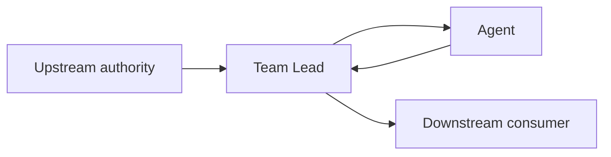

# &lt;Agent Name&gt; — High-Level Design

Use this template for `docs/agents/<agent-name>/HLD.md`. The HLD is an engineering
document for humans first and Agents second: make architectural intent and ownership
clear enough to scan in roughly 5–10 minutes. Prefer compact tables, bullets, and useful
diagrams over long narrative. Link canonical policies instead of copying them. Keep a
section brief or write `None` / `N/A` when it genuinely does not apply.

The HLD owns **why the Agent exists, what it owns, where it sits, and how it interacts at
a high level**. It does not prescribe files or become an implementation diary.

## Purpose

- **Problem:** <system problem this Agent solves>
- **Outcome:** <value this role adds>
- **Why a distinct Agent:** <why this responsibility needs a stable role>

## Position in the System

Describe where the Agent sits in the planned Team Lead architecture without implying
that unimplemented orchestration already exists. Use a small Mermaid or ASCII diagram
only when it makes relationships clearer.

## Responsibilities

| Responsibility | Owned outcome |
| --- | --- |
| <responsibility> | <observable result the Agent owns> |

Keep this to stable role responsibilities, not a task checklist.

## Non-Responsibilities

This section is mandatory. Name the owning role where known; do not merely say that the
Agent "does not" do something.

| Outside this Agent's scope | Owning authority / destination |
| --- | --- |
| <non-responsibility> | <Team Lead, Requirements, Product, Architect, another Agent, or human> |

## Authority and Decision Boundaries

| Decision area | Agent may decide | Requires input, approval, or escalation from |
| --- | --- | --- |
| <area> | <local decision boundary> | <owning authority and trigger> |

Distinguish implementation-local choices from product, requirements, architecture,
shared-contract, review, release, and human-approval authority.

## Inputs

Describe high-level inputs and their authority, not every schema field.

| Input | Source | Why it is needed | Required? |
| --- | --- | --- | --- |
| <input> | <owner> | <purpose> | <Yes / No> |

## Outputs

Describe high-level outputs and consumers, not every schema field.

| Output | Consumer | Meaning / guarantee |
| --- | --- | --- |
| <output> | <consumer> | <contract-level meaning> |

## Agent Interactions

Document only relevant relationships. Preserve Team Lead-mediated orchestration unless
an approved architecture explicitly defines another interaction; do not invent
uncontrolled peer-to-peer coordination.

| Agent / authority | Interaction | Ownership boundary |
| --- | --- | --- |
| <role> | <information or work exchanged> | <who decides and who reports> |

## Primary Workflows

Show only the major flows. Prefer a compact diagram for a multi-step flow.

1. <trigger and authoritative context>
2. <primary responsibility>
3. <result or escalation returned to the owning coordinator>

## Parallelism and Ownership Boundaries

- **May run concurrently:** <independent work and its ownership split>
- **Must be serialized/coordinated:** <shared contract, file, dependency, migration, or state>
- **Conflict handling:** <who resolves incompatible assumptions>

Parallel execution is optional. The design must remain correct when work is sequential.

## Failure and Escalation Model

| Condition | Classification | Expected response | Escalation target |
| --- | --- | --- | --- |
| <condition> | <blocked / failed / needs clarification / escalation> | <stop, report, retry, or continue safely> | <owner> |

Define the distinctions that matter for this role; do not force every possible status
into the design.

## Portability and Runtime Independence

Explain how the role remains a portable Agent via Skill. Define required capabilities,
not vendor-specific tools, APIs, prompts, or worker syntax. Internal workers remain an
implementation detail unless an approved external contract requires otherwise.

## Key Design Decisions

Record actual choices with design impact. Link an ADR if one is later warranted; do not
create a full ADR here.

| Decision | Choice | Rationale |
| --- | --- | --- |
| <decision> | <selected option> | <why this choice fits the boundaries and constraints> |

## Open Questions

Include only unresolved questions that could change architecture, authority, contracts,
or scope.

| Question | Why it matters | Owner / next decision point |
| --- | --- | --- |
| <question> | <design impact> | <owner or approval point> |
